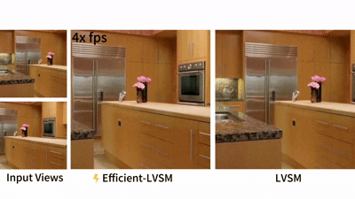
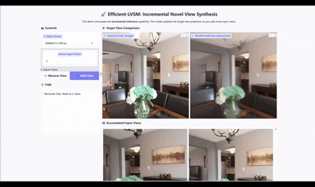

<div align="center">

# Efficient-LVSM: Faster, Cheaper, and Better Large View Synthesis Model <br> via Decoupled Co-Refinement Attention

<a href="https://arxiv.org/abs/xxxx.xxxxx"></a>
<a href="https://huggingface.co/Ayakaee/efficient-lvsm"></a>
<a href="https://your-project-page.github.io"></a>
<a href="https://github.com/Ayakaee/Efficient-LVSM/blob/main/LICENSE"></a>

**Xiaosong Jia**<sup>1,2,*</sup>, **Yihang Sun**<sup>2,*</sup>, **Junqi You**<sup>2</sup>, **Songbur Wong**<sup>2</sup>, **Zichen Zou**<sup>2</sup>, **Junchi Yan**<sup>2</sup>, **Zuxuan Wu**<sup>1</sup>, **Yu-Gang Jiang**<sup>1</sup>

<sup>1</sup>Institute of Trustworthy Embodied AI (TEAI), Fudan University <br>
<sup>2</sup>Sch. of Computer Science & Sch. of Artificial Intelligence, Shanghai Jiao Tong University

</div>

---


## 📸 Demo

<!-- <div align="center">
  <video src="assets/compare.mp4" width="800px">
  <br>
  <em>Efficient-LVSM delivers high-quality novel view synthesis with up to 4.4× faster inference than LVSM, while supporting incremental inference via KV-Cache.</em>
</div>

<div align="center">
  <video src="assets/app.mp4" width="800px">
  <br>
  <em>Interactive demo of Efficient-LVSM performing fast, high-quality novel view synthesis with incremental inference powered by KV-Cache.</em>
</div> -->

<div align="center">
  
  <br>
</div>

<div align="center">
  
  <br>
  <em>Interactive demo of Efficient-LVSM performing fast, high-quality novel view synthesis with incremental inference powered by KV-Cache.</em>
</div>


## 💡 Abstract & Highlights

We propose **Efficient-LVSM**, a dual-stream architecture that decouples input encoding from target decoding. Compared with previous monolithic approaches (e.g., LVSM), our design removes the quadratic complexity in input–target interactions and achieves state-of-the-art performance with significantly lower computational cost.

*   🚀 **High Efficiency**: Up to **4.4× faster** inference and **2× faster** training convergence compared with LVSM.
*   🧠 **Decoupled Architecture**: Input encoder (intra-view self-attention) + target decoder (self-then-cross attention).
*   💾 **KV-Cache Support**: Enables **incremental inference** with nearly constant cost when adding new views via KV-Cache.
*   🏆 **SOTA Performance**: Achieves **29.8 dB PSNR** on RealEstate10K.

## 📊 Results

### Quantitative Comparison
Our model consistently outperforms existing state-of-the-art methods on, while being significantly more efficient.

| Model | Parameters | Latency (ms) | GFLOPS | PSNR (RealEstate10K) |
| :--- | :---: | :---: | :---: | :---: |
| pixelSplat | 125M | 50.52 | 1934 | 26.09 |
| GS-LRM | 307M | 88.24 | 5047 | 28.10 |
| LVSM (Dec-Only) | 177M | 109.37 | 8523 | 29.67 |
| **Efficient-LVSM (Ours)** | **199M** | **24.78** | **1325** | **29.86** |


### Incremental Inference Efficiency

Our model supports efficient incremental inference: when a new input view is inserted, it leverages KV-Cache to avoid recomputing existing views. The table below reports the latency when adding one new input view to an existing set of \(N\) input views and rendering 8 target views.

| Number of Input Views | Efficient-LVSM (Ours) w/ KV-Cache (ms) | LVSM Dec-Only (ms) | Speedup Factor |
| :-------------------: | :------------------------------------: | :-------------------------------: | :------------: |
| 4                     | 24.37                                  | 123.1                             | **5.1x**       |
| 8                     | 28.62                                  | 286.0                             | **10.0x**      |
| 16                    | 42.96                                  | 801.7                             | **18.7x**      |
| 32                    | 72.84                                  | 2592                              | **35.6x**      |
| 48                    | 103.26                                 | 5408                              | **52.4x**      |
| 64                    | 138.43                                 | 9231                              | **66.7x**      |

*All measurements are obtained using* `scripts/eval_efficiency.sh`.


## 🚀 Get Started

### Requirements

- Python 3.11+
- PyTorch 2.0+
- CUDA 11.8+ (for GPU acceleration)

### 🛠️ Installation

```bash
# 1. Clone the repository
git clone git@github.com:Ayakaee/Efficient-LVSM.git
cd Efficient-LVSM

# 2. Create conda environment
conda create -n efficient-lvsm python=3.11
conda activate efficient-lvsm

# 3. Install PyTorch (adjust CUDA version as needed)
pip install torch torchvision --index-url https://download.pytorch.org/whl/cu118

# 4. Install dependencies
pip install -r requirements.txt
```

### 📦 Model Zoo

**Efficient-LVSM (Scene-Level, 512×512 resolution)**
- 🔗 Checkpoint: `https://huggingface.co/Ayakaee/efficient-lvsm/blob/main/efficient_lvsm_res512.pt`
- 📊 Performance on RealEstate10K: PSNR 29.86, SSIM 0.905, LPIPS 0.147
- 🎯 Training Dataset: [RealEstate10K](http://schadenfreude.csail.mit.edu:8000/)
- 💾 Model Size: ~199M parameters

**Efficient-LVSM (Scene-Level, 256×256 resolution)**
- 🔗 Checkpoint: `https://huggingface.co/Ayakaee/efficient-lvsm/blob/main/efficient_lvsm_res256.pt`
- 📊 Performance on RealEstate10K: PSNR 28.93, SSIM 0.895, LPIPS 0.102
- 🎯 Training Dataset: [RealEstate10K](http://schadenfreude.csail.mit.edu:8000/)
- 💾 Model Size: ~199M parameters

Note: Our model performance may degrade when given images with aspect ratios or resolutions different from those seen during training. If you plan to use the model for inference at other resolutions, we recommend fine-tuning the model for the specific resolution.

### 🎯 Quick Start

Download the pretrained model and run inference with a single command:

```bash
# Download model checkpoint
wget https://huggingface.co/coast01/LVSM/resolve/main/scene_decoder_only_256.pt

# Run inference
bash scripts/eval.sh
```

## 🚀 Inference

### 1. Standard Inference

```bash
bash scripts/eval.sh
```

We use `./data/evaluation_index_re10k.json` to specify the input and target view indices. This JSON file is adapted from [pixelSplat](https://github.com/dcharatan/pixelsplat). 

By default, we use the full list of scenes (`full_list.txt`) for evaluation. If you only need a quick test run, you can switch to `partial_list.txt` (first 100 scenes), but the results will be less accurate.

After inference, the code generates an HTML file in the `inference_out_dir` folder. You can open this HTML file in a browser to view the results.

### 2. Incremental Inference Demo

For incremental inference, where input views are processed one by one and each intermediate result is visualized, we provide a demo based on `gradio`:

```bash
bash scripts/app.sh
```
For this demo, we provide a more generalizable checkpoint, which can be downloaded from: `https://huggingface.co/Ayakaee/efficient-lvsm/blob/main/efficient_lvsm_inc_demo.pt`.

Note: Due to the uncertain latency introduced by Gradio, the latency shown in this demo is **not** the accurate latency of our model. For precise evaluation, please use `scripts/eval_efficiency.sh`.

**Key Features:**
- Processes input views sequentially (1, 2, 3, 4 views, etc.)
- Interactive inference: freely add or remove views
- Utilizes KV-Cache for improved efficiency


### 3. Incremental Inference Efficiency

To evaluate the latency and memory overhead during incremental inference:

```bash
bash scripts/eval_efficiency.sh
```

You can set the maximum number of input views and the number of target views by modifying `training.num_input_views` and `training.num_target_views` in the config file.

The results are saved to `incremental_result.csv`.

## 🏋️ Training

### Dataset Preparation

Download and prepare the RealEstate10K dataset:

```bash
# Download RealEstate10K dataset
# Follow instructions at: http://schadenfreude.csail.mit.edu:8000/

# Prepare dataset structure
python utils/process_data.py --data_dir /path/to/realestate10k
```

### Training Command

You need to create a WandB API key file for logging and save it as `configs/api_keys.yaml`.

```bash
torchrun --nproc_per_node 4 --nnodes 1 \
    --rdzv_id 18635 --rdzv_backend c10d --rdzv_endpoint localhost:29502 \
    train.py --config configs/Efficient-LVSM.yaml
```

The training will be distributed across 4 GPUs and 1 node. `Efficient-LVSM.yaml` is the configuration file for the model.

You can also use the provided bash script for simplicity:
```bash
bash scripts/train.sh
```


## 📝 Citation 

If you find this work useful in your research, please consider citing:

```bibtex
@article{efficient-lvsm2025,
  title={Efficient-LVSM: Faster, Cheaper, and Better Large View Synthesis Model via Decoupled Co-Refinement Attention},
  author={Jia, Xiaosong and Sun, Yihang and You, Junqi and Wong, Songbur and Zou, Zichen and Yan, Junchi and Wu, Zuxuan and Jiang, Yu-Gang},
  journal={arXiv preprint arXiv:xxxx.xxxxx},
  year={2025}
}
```

## 🙏 Acknowledgement

This work is supported by the Institute of Trustworthy Embodied AI (TEAI) at Fudan University and Shanghai Jiao Tong University. We thank the authors of [LVSM](https://github.com/hkust-vgd/LVSM) and [pixelSplat](https://github.com/dcharatan/pixelsplat) for their valuable open-source contributions.
